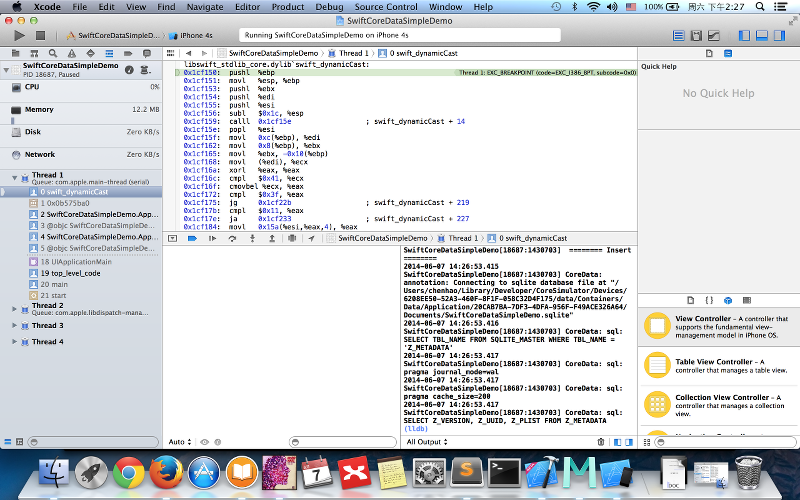

# Step by Step Do IOS Swift CoreData Simple Demo #

## 简介

这篇文章记录了在 IOS 中使用 Swift 操作 CoreData 的一些基础性内容，由于缺乏文档，基本上都是自行实验的结果，错漏不可避免，还请谅解。

部分内容借鉴了 Tim Roadley 的《Learning.Core.Data.for.iOS(2013.11)》, 这本书主要介绍 ObjC的 CoreData 。

---
## 创建一个新 XCode 项目

* 创建一个新的 XCode 项目。

* 创建一个 Empty Application

* 填写项目相关信息，如设置项目名称为： SwiftCoreDataSimpleDemo， 注意选择语言为 Swift， 并且勾选上 Use Core Data。

* 选择存储项目的目录

* 创建的新项目如下图所示

---
## 修改 Core Data Model

* 选择 SwiftCoreDataSimpleDemo.xcdatamodeld 文件，目前还是空的。

* 创建两个 Entity， 分别命名为 Family 和 Member。

* 在生成模型文件之前，我们可以创建一个名为 models 的 Group ， 用于存放生成的模型文件。

* 选中 SwiftCoreDataSimpleDemo.xcdatamodeld 文件的某个 Entity 之后，能够在 Editor 菜单中找到 Create NSManagedObject Subclass，选择此项目，开始创建模型文件。

* 跟随向导，完成模型创建，可以选中所有的 Entity ，并将存储位置指定为我们刚创建的 models Group 中。

* 在结束之前，XCode 会弹出对话框，问是否创建用于 Swift 和 ObjC 协同工作的库文件 SwiftCoreDataSimpleDemo-Bridging-Header.h， 此时当然是选择 Yes。

生成完成之后，就能够在 Project 中看见新的模型文件了。此时，SwiftCoreDataSimpleDemo-Bridging-Header.h 还是空的，我们需要在其中增加需要被 Swift 访问的头文件。结果如下图所示：

	#import "Family.h"
	#import "Member.h"
	

---
## 修改 AppDelegate

和新建 ObjC App 类似，新建项目将操作 CoreData 的代码添加在 AppDelegate.swift 文件中。为了能够使代码更简洁和清晰，我们将这部分代码提炼出来，移动到 CoreDataHelper.swift 中去。

* 打开原始的 AppDelegate.swift，在程序的后半部分，能够看见操作 CoreData 相关的代码.如下图所示。

* 创建新 CoreDataHelper.swift 文件。修改文件名为 CoreDataHelper。

* 在 AppDelegate.swift 中将 `func saveContext ()` 及其后面的代码选中，转移到 CoreDataHelper.swift 文件中。并对其做些小调整，将所用到的项目名称提成常量，放在 CoreDataHelper 前部，这样，以后如果需要在历史项目中使用 CoreDataHelper，就十分方便了。

完成后的 CoreDataHelper.swift 代码如下：

    //
    //  CoreDataHelper.swift
    //  SwiftCoreDataSimpleDemo
    //
    //  Created by CHENHAO on 14-6-7.
    //  Copyright (c) 2014年 CHENHAO. All rights reserved.
    //
    
    import CoreData
    
    class CoreDataHelper{
        
        let storeName = "SwiftCoreDataSimpleDemo"
        let storeFilename = "SwiftCoreDataSimpleDemo.sqlite"
        
        // #pragma mark - Core Data stack
        
        // Returns the managed object context for the application.
        // If the context doesn't already exist, it is created and bound to the persistent store coordinator for the application.
        var managedObjectContext: NSManagedObjectContext {
        if !_managedObjectContext {
            let coordinator = self.persistentStoreCoordinator
            if coordinator != nil {
                _managedObjectContext = NSManagedObjectContext()
                _managedObjectContext!.persistentStoreCoordinator = coordinator
            }
            }
            return _managedObjectContext!
        }
        var _managedObjectContext: NSManagedObjectContext? = nil
        
        // Returns the managed object model for the application.
        // If the model doesn't already exist, it is created from the application's model.
        var managedObjectModel: NSManagedObjectModel {
        if !_managedObjectModel {
            let modelURL = NSBundle.mainBundle().URLForResource(storeName, withExtension: "momd")
            _managedObjectModel = NSManagedObjectModel(contentsOfURL: modelURL)
            }
            return _managedObjectModel!
        }
        var _managedObjectModel: NSManagedObjectModel? = nil
        
        // Returns the persistent store coordinator for the application.
        // If the coordinator doesn't already exist, it is created and the application's store added to it.
        var persistentStoreCoordinator: NSPersistentStoreCoordinator {
        if !_persistentStoreCoordinator {
            let storeURL = self.applicationDocumentsDirectory.URLByAppendingPathComponent(storeFilename)
            var error: NSError? = nil
            _persistentStoreCoordinator = NSPersistentStoreCoordinator(managedObjectModel: self.managedObjectModel)
            if _persistentStoreCoordinator!.addPersistentStoreWithType(NSSQLiteStoreType, configuration: nil, URL: storeURL, options: nil, error: &error) == nil {
                /*
                Replace this implementation with code to handle the error appropriately.
                
                abort() causes the application to generate a crash log and terminate. You should not use this function in a shipping application, although it may be useful during development.
                
                Typical reasons for an error here include:
                * The persistent store is not accessible;
                * The schema for the persistent store is incompatible with current managed object model.
                Check the error message to determine what the actual problem was.
                
                
                If the persistent store is not accessible, there is typically something wrong with the file path. Often, a file URL is pointing into the application's resources directory instead of a writeable directory.
                
                If you encounter schema incompatibility errors during development, you can reduce their frequency by:
                * Simply deleting the existing store:
                NSFileManager.defaultManager().removeItemAtURL(storeURL, error: nil)
                
                * Performing automatic lightweight migration by passing the following dictionary as the options parameter:
                [NSMigratePersistentStoresAutomaticallyOption: true, NSInferMappingModelAutomaticallyOption: true}
                
                Lightweight migration will only work for a limited set of schema changes; consult "Core Data Model Versioning and Data Migration Programming Guide" for details.
                
                */
                //println("Unresolved error \(error), \(error.userInfo)")
                abort()
            }
            }
            return _persistentStoreCoordinator!
        }
        var _persistentStoreCoordinator: NSPersistentStoreCoordinator? = nil
        
        // #pragma mark - Application's Documents directory
        
        // Returns the URL to the application's Documents directory.
        var applicationDocumentsDirectory: NSURL {
        let urls = NSFileManager.defaultManager().URLsForDirectory(.DocumentDirectory, inDomains: .UserDomainMask)
            return urls[urls.endIndex-1] as NSURL
        }
        
        func saveContext () {
            var error: NSError? = nil
            let managedObjectContext = self.managedObjectContext
            if managedObjectContext != nil {
                if managedObjectContext.hasChanges && !managedObjectContext.save(&error) {
                    // Replace this implementation with code to handle the error appropriately.
                    // abort() causes the application to generate a crash log and terminate. You should not use this function in a shipping application, although it may be useful during development.
                    //println("Unresolved error \(error), \(error.userInfo)")
                    abort()
                }
            }
        }
    }
	
	
* 修改 AppDelegate.swift。并创建一个 CoreDataHelper 的实例，用于操作 CoreData。

将 `applicationWillTerminate(application: UIApplication)` 方法之后的内容全部替换为以下代码。

    var cdh: CoreDataHelper {
    if !_cdh {
        _cdh = CoreDataHelper()
        }
        return _cdh!
    }
    var _cdh: CoreDataHelper? = nil

* 修改 AppDelegate.swift，以自动保存 CoreData。

代码如下：

    func applicationDidEnterBackground(application: UIApplication) {
        // Use this method to release shared resources, save user data, invalidate timers, and store enough application state information to restore your application to its current state in case it is terminated later.
        // If your application supports background execution, this method is called instead of applicationWillTerminate: when the user quits.
        
        self.cdh.saveContext()
    }
    ...
    func applicationWillTerminate(application: UIApplication) {
        // Called when the application is about to terminate. Save data if appropriate. See also applicationDidEnterBackground:.
        // Saves changes in the application's managed object context before the application terminates.
        
        self.cdh.saveContext()
    }

---
## 操作模型对象
        
接下来我们将在 AppDelegate.swift 中创建一个访问 CoreData 的 demoFamily 方法，用于操作 CoreData。
这段代码放在 `func applicationDidBecomeActive(application: UIApplication)` 中执行，操作结果从 Log 文件中查看。

    func applicationDidBecomeActive(application: UIApplication) {
        // Restart any tasks that were paused (or not yet started) while the application was inactive. If the application was previously in the background, optionally refresh the user interface.
        
        self.demoFamily()
    }

demoFamily() 的具体实现如下，代码说明请参考注释：

    func demoFamily(){
        var newItemNames = ["Apples", "Milk", "Bread", "Cheese", "Sausages", "Butter", "Orange Juice", "Cereal", "Coffee", "Eggs", "Tomatoes", "Fish"]
        
        // add families
        NSLog(" ======== Insert ======== ")
        
        for newItemName in newItemNames {
            var newItem: Family = NSEntityDescription.insertNewObjectForEntityForName("Family", inManagedObjectContext: self.cdh.managedObjectContext) as Family
            
            newItem.name = newItemName
            NSLog("Inserted New Family for \(newItemName) ")
        }
        
        //self.cdh.saveContext()
        
        //fetch families
        NSLog(" ======== Fetch ======== ")
        
        var error: NSError? = nil
        var fReq: NSFetchRequest = NSFetchRequest(entityName: "Family")
        
        // 设置过滤条件
        fReq.predicate = NSPredicate(format:"name CONTAINS 'B' ")
        
        // 设置结果排序规则，此处设置为按 Name 逆序
        var sorter: NSSortDescriptor = NSSortDescriptor(key: "name" , ascending: false)
        fReq.sortDescriptors = [sorter]
        
        var result = self.cdh.managedObjectContext.executeFetchRequest(fReq, error:&error)
        for resultItem : AnyObject in result {
            var familyItem = resultItem as Family
            NSLog("Fetched Family for \(familyItem.name) ")
        }
        
        //delete families
        NSLog(" ======== Delete ======== ")
        
        fReq = NSFetchRequest(entityName: "Family")
        result = self.cdh.managedObjectContext.executeFetchRequest(fReq, error:&error)
        
        for resultItem : AnyObject in result {
            var familyItem = resultItem as Family
            NSLog("Deleted Family for \(familyItem.name) ")
            self.cdh.managedObjectContext.deleteObject(familyItem)
        }
        
        //self.cdh.saveContext()
        
        NSLog(" ======== Check Delete ======== ")
        
        result = self.cdh.managedObjectContext.executeFetchRequest(fReq, error:&error)
        if result.isEmpty {
            NSLog("Deleted All Families")
        }
        else{
            for resultItem : AnyObject in result {
                var familyItem = resultItem as Family
                NSLog("Fetched Error Family for \(familyItem.name) ")
            }
        }
    }

Log输出如下：

    2014-06-07 14:01:53.717 SwiftCoreDataSimpleDemo[18348:1419062] Application windows are expected to have a root view controller at the end of application launch
    2014-06-07 14:01:54.100 SwiftCoreDataSimpleDemo[18348:1419062]  ======== Insert ======== 
    2014-06-07 14:01:54.115 SwiftCoreDataSimpleDemo[18348:1419062] Inserted New Family for Apples 
    2014-06-07 14:01:54.115 SwiftCoreDataSimpleDemo[18348:1419062] Inserted New Family for Milk 
    2014-06-07 14:01:54.115 SwiftCoreDataSimpleDemo[18348:1419062] Inserted New Family for Bread 
    2014-06-07 14:01:54.116 SwiftCoreDataSimpleDemo[18348:1419062] Inserted New Family for Cheese 
    2014-06-07 14:01:54.116 SwiftCoreDataSimpleDemo[18348:1419062] Inserted New Family for Sausages 
    2014-06-07 14:01:54.116 SwiftCoreDataSimpleDemo[18348:1419062] Inserted New Family for Butter 
    2014-06-07 14:01:54.117 SwiftCoreDataSimpleDemo[18348:1419062] Inserted New Family for Orange Juice 
    2014-06-07 14:01:54.117 SwiftCoreDataSimpleDemo[18348:1419062] Inserted New Family for Cereal 
    2014-06-07 14:01:54.117 SwiftCoreDataSimpleDemo[18348:1419062] Inserted New Family for Coffee 
    2014-06-07 14:01:54.118 SwiftCoreDataSimpleDemo[18348:1419062] Inserted New Family for Eggs 
    2014-06-07 14:01:54.118 SwiftCoreDataSimpleDemo[18348:1419062] Inserted New Family for Tomatoes 
    2014-06-07 14:01:54.118 SwiftCoreDataSimpleDemo[18348:1419062] Inserted New Family for Fish 
    2014-06-07 14:01:54.118 SwiftCoreDataSimpleDemo[18348:1419062]  ======== Fetch ======== 
    2014-06-07 14:01:54.121 SwiftCoreDataSimpleDemo[18348:1419062] Fetched Family for Butter 
    2014-06-07 14:01:54.122 SwiftCoreDataSimpleDemo[18348:1419062] Fetched Family for Bread 
    2014-06-07 14:01:54.122 SwiftCoreDataSimpleDemo[18348:1419062]  ======== Delete ======== 
    2014-06-07 14:01:54.123 SwiftCoreDataSimpleDemo[18348:1419062] Deleted Family for Tomatoes 
    2014-06-07 14:01:54.123 SwiftCoreDataSimpleDemo[18348:1419062] Deleted Family for Cereal 
    2014-06-07 14:01:54.123 SwiftCoreDataSimpleDemo[18348:1419062] Deleted Family for Orange Juice 
    2014-06-07 14:01:54.123 SwiftCoreDataSimpleDemo[18348:1419062] Deleted Family for Eggs 
    2014-06-07 14:01:54.124 SwiftCoreDataSimpleDemo[18348:1419062] Deleted Family for Milk 
    2014-06-07 14:01:54.124 SwiftCoreDataSimpleDemo[18348:1419062] Deleted Family for Butter 
    2014-06-07 14:01:54.124 SwiftCoreDataSimpleDemo[18348:1419062] Deleted Family for Sausages 
    2014-06-07 14:01:54.125 SwiftCoreDataSimpleDemo[18348:1419062] Deleted Family for Cheese 
    2014-06-07 14:01:54.125 SwiftCoreDataSimpleDemo[18348:1419062] Deleted Family for Apples 
    2014-06-07 14:01:54.125 SwiftCoreDataSimpleDemo[18348:1419062] Deleted Family for Bread 
    2014-06-07 14:01:54.125 SwiftCoreDataSimpleDemo[18348:1419062] Deleted Family for Fish 
    2014-06-07 14:01:54.126 SwiftCoreDataSimpleDemo[18348:1419062] Deleted Family for Coffee 
    2014-06-07 14:01:54.126 SwiftCoreDataSimpleDemo[18348:1419062]  ======== Check Delete ======== 
    2014-06-07 14:01:54.127 SwiftCoreDataSimpleDemo[18348:1419062] Deleted All Families
    Program ended with exit code: 9

---
## 不工作的 Member.swift 代码

参考 Swift 文档，尝试创建 Member.swift，编译通过，运行测试失败。因文档有限，没法进一步确定原因。记录在此，以供大家探讨。

Swift 文档的相关说明如下，[Implementing Core Data Managed Object Subclasses](https://developer.apple.com/library/prerelease/ios/documentation/Swift/Conceptual/BuildingCocoaApps/WritingSwiftClassesWithObjective-CBehavior.html#//apple_ref/doc/uid/TP40014216-CH5-XID_66)

    Implementing Core Data Managed Object Subclasses
    
    Core Data provides the underlying storage and implementation of properties in subclasses
     of the NSManagedObject class. Add the @NSManaged attribute before each property definition
      in your managed object subclass that corresponds to an attribute or relationship in your 
      Core Data model. Like the @dynamic attribute in Objective-C, the @NSManaged attribute 
      informs the Swift compiler that the storage and implementation of a property will be 
      provided at runtime. However, unlike @dynamic, the @NSManaged attribute is available only 
      for Core Data support. 
    
根据文档编写 Member.swift 如下：

    import CoreData
    
    class Member: NSManagedObject {
        @NSManaged var name: String
        @NSManaged var sex: String
        @NSManaged var birthday: NSDate
    }

将 SwiftCoreDataSimpleDemo-Bridging-Header.h 中的 Member.h 行注释掉：

	#import "Family.h"
	// #import "Member.h"

运行之后，编译成功，但运行出错闪退，出错界面如下。

---
## 代码地址 ##

[https://github.com/iascchen/SwiftCoreDataSimpleDemo/](https://github.com/iascchen/SwiftCoreDataSimpleDemo/)

---

打完收工

---

Author : iascchen(at)gmail(dot)com

Date : 2014-6-7

新浪微博 : [@问天鼓](http://www.weibo.com/iascchen)

---